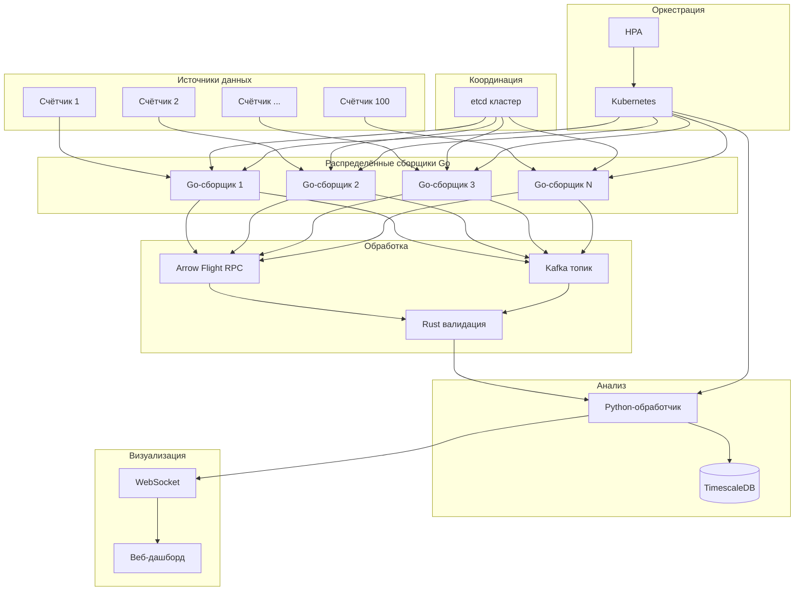

# Архитектура системы анализа энергопотребления

## Обзор
Система для распределённого сбора данных со счётчиков электроэнергии, оконной агрегации, передачи через Apache Arrow, валидации через Rust-библиотеку, развёртывания в Kubernetes с автоскалированием, сравнения производительности Go vs Python, потоковой обработки через Kafka и веб-дашборда реального времени.

## Компоненты системы

### 1. Эмуляторы счётчиков
- Генерация данных: мощность (кВт·ч), метка времени, идентификатор счётчика
- 100 счётчиков, опрос каждые 10 секунд
- REST/gRPC эндпоинты или прямое подключение

### 2. Распределённые Go-сборщики
- Несколько экземпляров, работающих параллельно
- Координация через etcd для распределения шардов
- Каждый сборщик отвечает за подмножество счётчиков
- Поддержка перебалансировки при добавлении/удалении сборщиков

### 3. Оконная агрегация в Go
- Tumbling window: каждые 30 секунд или каждые 100 записей
- Агрегации: сумма, среднее, минимум, максимум
- Отправка агрегированных данных вместо сырых записей

### 4. Передача данных через Apache Arrow
- Go-сервер Flight RPC отдаёт RecordBatch
- Python-клиент принимает данные в формате Arrow
- Сравнение производительности и объёма данных с JSON

### 5. Rust-библиотека валидации
- Проверка формата полей, диапазонов значений
- Интеграция в Go через cgo
- Интеграция в Python через PyO3

### 6. Обработка в Python
- Приём данных через Arrow Flight
- Дополнительная обработка и анализ
- Сохранение в базу данных (TimescaleDB/InfluxDB)

### 7. Потоковая обработка через Kafka
- Go-сборщик пишет в топик Kafka
- Python-обработчик читает из топика
- Скользящее окно 5 минут для агрегации в реальном времени

### 8. Веб-дашборд реального времени
- Streamlit или FastAPI + WebSocket
- Графики текущей статистики
- Обновление по мере поступления данных

### 9. Мониторинг и автоскалирование
- Kubernetes Deployment для сборщиков
- HPA на основе длины очереди или CPU
- Prometheus метрики, Grafana дашборды

## Диаграмма архитектуры



## Структура проекта

```
energy-monitoring-system/
├── README.md
├── go.mod
├── docker-compose.yml
├── k8s/
│   ├── deployment-go-collector.yaml
│   ├── deployment-python-processor.yaml
│   ├── service-etcd.yaml
│   ├── service-arrow-flight.yaml
│   ├── hpa-go-collector.yaml
│   └── ingress-dashboard.yaml
├── plans/
│   └── architecture_plan.md
├── emulators/
│   ├── go/
│   │   └── meter-emulator/
│   └── python/
│       └── meter-emulator.py
├── go-collector/
│   ├── cmd/
│   │   └── collector/
│   │       └── main.go
│   ├── internal/
│   │   ├── collector/
│   │   ├── aggregation/
│   │   ├── etcd-coordination/
│   │   ├── arrow-flight/
│   │   └── validation/
│   ├── pkg/
│   │   ├── models/
│   │   └── utils/
│   └── Dockerfile
├── rust-validation/
│   ├── Cargo.toml
│   ├── src/
│   │   └── lib.rs
│   ├── cgo-binding/
│   └── pyo3-binding/
├── python-processor/
│   ├── main.py
│   ├── arrow_client.py
│   ├── kafka_consumer.py
│   ├── window_processor.py
│   ├── requirements.txt
│   └── Dockerfile
├── web-dashboard/
│   ├── app.py
│   ├── requirements.txt
│   ├── static/
│   └── templates/
├── kafka-setup/
│   ├── docker-compose-kafka.yml
│   └── topics-create.sh
├── monitoring/
│   ├── prometheus.yml
│   ├── grafana-dashboards/
│   └── alerts/
└── benchmarks/
    ├── go-vs-python/
    │   ├── load-test.go
    │   ├── load-test.py
    │   └── results/
    └── arrow-vs-json/
        ├── benchmark.go
        └── benchmark.py
```

## Детализация компонентов

### Координация через etcd
- Ключи: `/collectors/{id}/shards` - список шардов (счётчиков)
- Лидер-выбор для координатора
- Сервис обнаружения (service discovery)
- Механизм heartbeat для определения живых сборщиков

### Оконная агрегация в Go
- Реализация на основе time.Ticker или количество записей
- Структура окна:
```go
type Window struct {
    StartTime    time.Time
    EndTime      time.Time
    Counters     map[string]*AggregatedData
}
```
- Агрегированные данные:
```go
type AggregatedData struct {
    Sum     float64
    Avg     float64
    Min     float64
    Max     float64
    Count   int
}
```

### Apache Arrow Flight RPC
- Go сервер реализует интерфейс `flight.Server`
- Схема Arrow: timestamp, meter_id, power, validated
- Python клиент использует `pyarrow.flight`

### Rust библиотека валидации
```rust
pub struct MeterReading {
    pub meter_id: String,
    pub timestamp: i64,
    pub power: f64,
}

pub fn validate_reading(reading: &MeterReading) -> Result<(), ValidationError> {
    // Проверки
}
```

### Развёртывание в Kubernetes
- StatefulSet для etcd
- Deployment для Go-сборщиков с readiness/liveness пробами
- ConfigMap для конфигурации
- Service для Arrow Flight сервера
- HPA на основе custom метрик (длина очереди Kafka)

### Сравнение производительности Go vs Python
- Тестовый стенд с одинаковой нагрузкой
- Метрики: пропускная способность (записей/сек), задержка, потребление CPU, памяти
- Визуализация результатов в Grafana

### Потоковая обработка через Kafka
- Топик `meter-readings-raw` для сырых данных
- Топик `meter-readings-aggregated` для агрегированных
- Python обработчик с библиотекой `confluent-kafka`
- Оконная обработка с помощью `kafka-python` или `faust`

### Веб-дашборд
- Streamlit для быстрого прототипирования
- Графики: реальная мощность по счётчикам, агрегированная статистика
- WebSocket для push-уведомлений
- Исторические данные из базы

## Последовательность развёртывания

1. Запустить инфраструктуру: etcd, Kafka, база данных
2. Развернуть Go-сборщики в Kubernetes
3. Настроить HPA для автоскалирования
4. Запустить Python-обработчик
5. Настроить мониторинг (Prometheus, Grafana)
6. Запустить веб-дашборд
7. Провести нагрузочное тестирование
8. Сравнить производительность Go vs Python

## Требования к окружению

- Go 1.21+
- Python 3.10+
- Rust 1.70+
- Docker 24+
- Kubernetes 1.27+ (minikube/k3s)
- Apache Arrow 12+
- Apache Kafka 3.4+

## Следующие шаги

1. Создать базовую структуру проекта
2. Реализовать эмулятор счётчиков
3. Реализовать Go-сборщик с etcd координацией
4. Добавить оконную агрегацию
5. Интегрировать Apache Arrow Flight
6. Разработать Rust библиотеку валидации
7. Настроить Kafka потоковую обработку
8. Создать веб-дашборд
9. Написать конфигурации Kubernetes
10. Провести тестирование и бенчмарки

## Контакты и документация

Документация будет поддерживаться в директории `docs/`. Все компоненты должны иметь README с примерами использования.